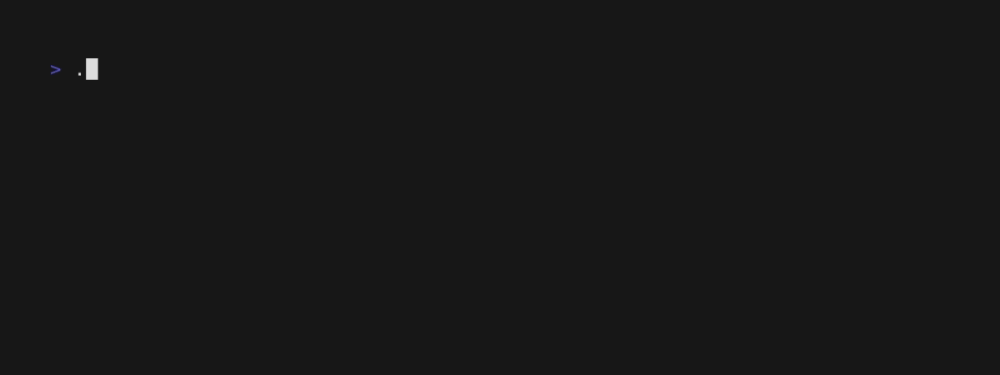
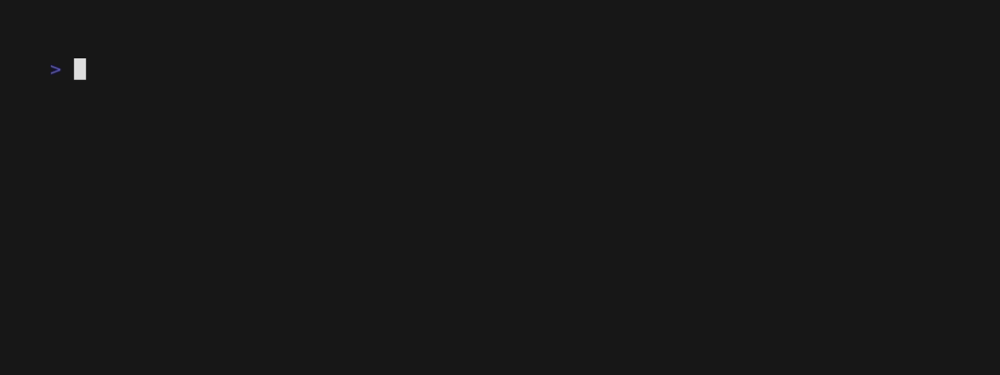

# Examples

### Alt Screen Toggle

The `altscreen-toggle` example shows how to transition between the alternative
screen buffer and the normal screen buffer using Latte.

### Cursor
The `cursor` example shows how to spawn an artificial cursor in Latte application, to be used mostly as a component in more complex scenarios (eg. Input, Text area)

### Full Screen

The `fullscreen` example shows how to make a Latte application fullscreen.

### Mouse

The `mouse` example shows how to receive mouse events in a Latte
application.

<a href="./src/main/java/org/flatscrew/latte/examples/mouse/MouseExample.java">
  Code
</a>

### Demo

The `demo` example shows a choice menu with the ability to select an option.

### Http

The `http` example shows how to make an `http` call within your Latte application.

