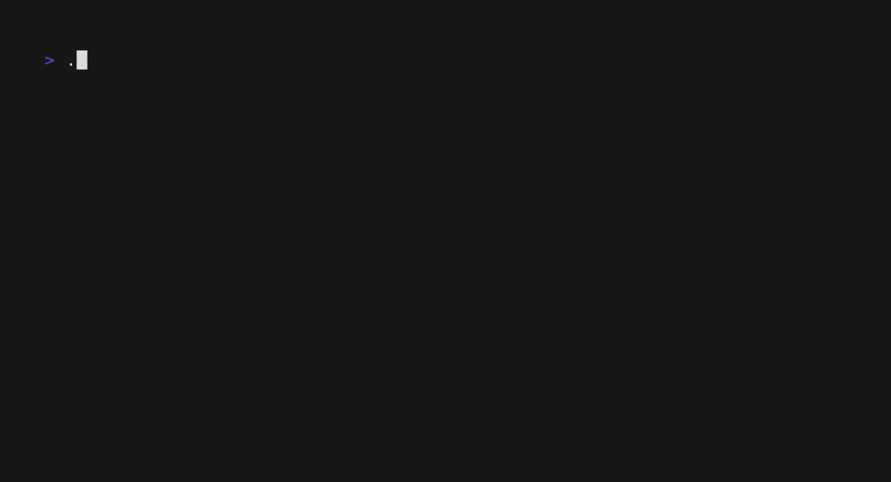
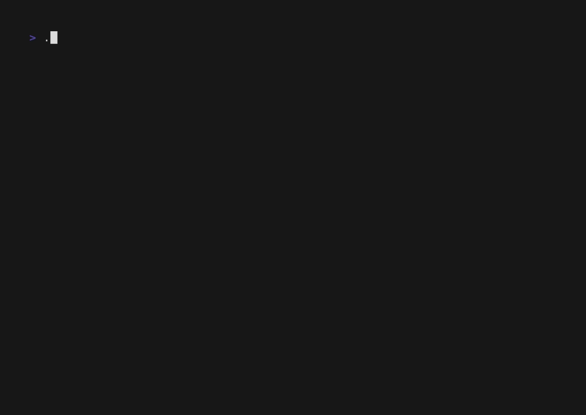
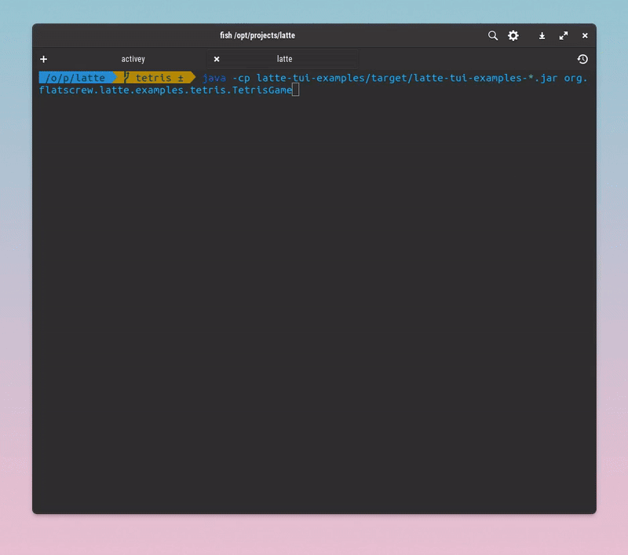
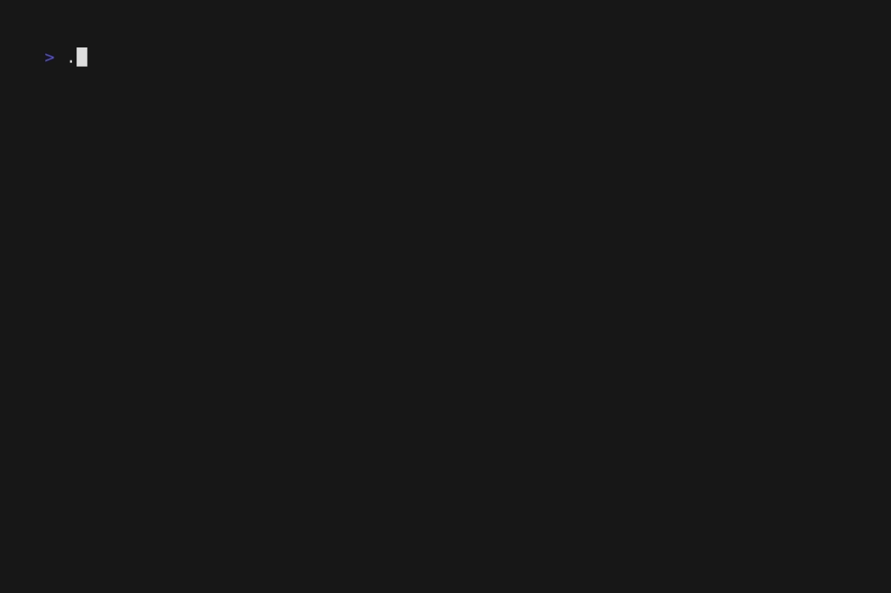

# Examples

### Alt Screen Toggle

The `altscreen-toggle` example shows how to transition between the alternative
screen buffer and the normal screen buffer using Latte.

### Cursor
The `cursor` example shows how to spawn an artificial cursor in Latte application, to be used mostly as a component in more complex scenarios (eg. Input, Text area)

### Full Screen

The `fullscreen` example shows how to make a Latte application fullscreen.

### Mouse

The `mouse` example shows how to receive mouse events in a Latte
application.

<a href="./src/main/java/org/flatscrew/latte/examples/mouse/MouseExample.java">
  Code
</a>

### Demo

The `demo` example shows a choice menu with the ability to select an option.

### Http

The `http` example shows how to make an `http` call within your Latte application.

### Paginator

The `paginator` example shows how to build a simple paginated list.

### Text Input

The `textinput` example demonstrates a simple Latte application using a textinput bubble.

### Multiple Text Inputs

The `textinputs` example shows multiple `textinputs` and being able to switch focus between them as well as changing the cursor mode.

### Default List

The `list-default` example shows how to use the list bubble. Have a look [here](../ListComponent.md) for some more details on how to use `List`.

### Fancy List

The `list-fancy` example shows how to use the list bubble with extra customizations.

### Simple List

The `list-simple` example shows how to use the list and customize it to have a simpler, more compact, appearance.
This example shows how to implement your own custom **ItemDelegate**.

### Tetris
A fully functional Tetris clone written with Latte :)

### Game of Life
 A cellular automaton implementation.

 

### Fireworks
Fireworks simulation :) Ported from https://github.com/Wayoung7/firework-rs/

 